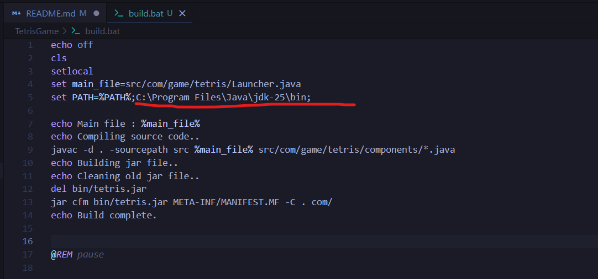
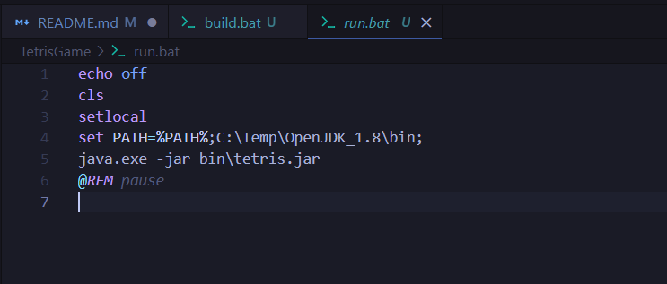

# Tetris Game
This project is a didactic purpose and an example of how to create a basic game in java and compile a java project from scratch.

<b>Playing tetris game</b>

<video width="100%" controls>
  <source src="./img/VID-01.mp4" type="video/mp4">
Your browser does not support the video tag.
</video>

<b>build.bat</b> 
To compile for windows execute this bat file.
But before make sure have installed Java SDK and configured in the PATH environment variable or edit the bat file and map the path to the SDK bin folder.

<b>run.bat</b> 
To run the game execute this bat file.
But before make sure have compiled the game using build.bat.

